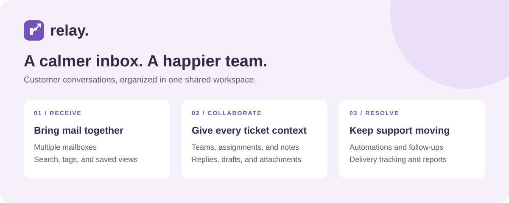
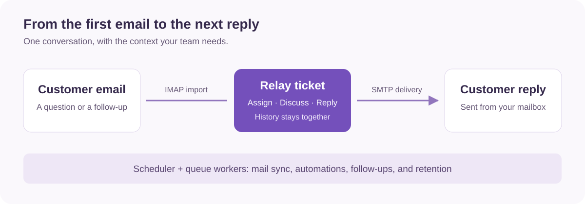

# Relay Helpdesk

A shared support inbox for managing customer conversations, coordinating teams, and keeping email follow-ups in one place.



Relay turns incoming email into tickets with conversation history, ownership, priorities, and delivery status. Agents can reply to customers, leave internal notes, and use saved replies while administrators manage mailboxes, workflows, and sending controls.

Built with **Laravel 13**, **Vue 3**, **Inertia 3**, and **Vite 8**.

[Features](#features) · [How it works](#how-it-works) · [Requirements](#requirements) · [Installation](#installation) · [Email and background tasks](#email-and-background-tasks)

## Features

| Area | What you can do |
| --- | --- |
| Shared inbox | Connect multiple email accounts, search tickets, use saved views, and organize conversations into inbox, archive, spam, and trash. |
| Ticket management | Assign teams and agents, set priorities and statuses, add tags and custom fields, merge tickets, and perform bulk actions. |
| Conversations | Send customer replies, leave internal notes, save drafts, and work with attachments and inline images. |
| Workflows | Use canned replies, apply macros, configure conditional automations, and schedule follow-ups. |
| Email operations | Import mail through IMAP, send through SMTP, inspect delivery attempts, and retry failed messages. |
| Sending controls | Pause outgoing mail, configure automatic stops after delivery failures, and manage sender policies and recipient suppressions. |
| Translation | Configure incoming and outgoing translation, select customer languages, and review translated replies. Requires a Google Translate browser API key. |
| Reporting | Review support reports, ticket history, and workspace activity. |
| Integrations | Create scoped API keys for external ticket creation and delivery events. |

## How it works



1. **Receive a request.** Connect a support mailbox to import email, create a ticket in the app, or submit one through the external API. Incoming email replies are matched to conversations using message references.
2. **Organize the work.** Assign a team or agent, choose a priority, and add tags or custom fields. Automations can apply actions when their conditions match.
3. **Collaborate and respond.** Read the conversation history, leave internal notes, and prepare a reply using canned responses or a saved draft. Customer replies use the ticket's mailbox SMTP configuration.
4. **Follow through.** Track delivery, schedule follow-ups, update the ticket status, and review activity and reports. Scheduled jobs also handle inactive-ticket archiving and spam/trash retention.

*The images above are explanatory diagrams, not application screenshots.*

## Requirements

| Requirement | Version or configuration |
| --- | --- |
| PHP | **8.4.1 or later**, compatible with `composer.lock`. Although `composer.json` allows PHP 8.3, the locked Symfony packages require at least 8.4.1. |
| Composer | **2.2+**, for installing PHP dependencies. |
| Node.js | **20.19+ within Node 20, or 22.12+**, as required by Vite 8. |
| npm | Required to install and build frontend assets; use the committed `package-lock.json`. |
| Database | SQLite is the default. Enable PHP's `pdo_sqlite` extension; another configured database requires its matching PDO driver. |
| PHP extensions | `ctype`, `dom`, `fileinfo`, `filter`, `hash`, `iconv`, `json`, `libxml`, `mbstring`, `openssl`, `pcre`, `PDO`, `Phar`, `session`, `tokenizer`, `xml`, `xmlwriter`, and `zip` for the locked dependencies, development tools, and application. |
| Email | IMAP and SMTP credentials with TLS support to receive and send customer email. Not required to explore sample conversations. |
| Background processing | A queue worker for `default` jobs, a worker for `incoming` mail, and a running scheduler. |
| File permissions | The web server must be able to write to `storage/` and `bootstrap/cache/`. |

Optional: a Google Translate browser API key for translation. The default configuration stores sessions, cache, and queued jobs in the database, so Redis is not required.

## Installation

### 1. Get the project and dependencies

```bash
git clone https://github.com/ahmadzissa/helpdesk.git
cd helpdesk
composer install
npm ci --ignore-scripts
```

### 2. Create the local configuration

These PHP commands work in both PowerShell and Unix shells:

```bash
php -r "file_exists('.env') || copy('.env.example', '.env');"
php -r "file_exists('database/database.sqlite') || touch('database/database.sqlite');"
php artisan key:generate --no-interaction
```

The supplied `.env.example` uses SQLite and [http://localhost:8000](http://localhost:8000). If you use a different database or address, edit `.env` before migrating. Keep `APP_URL` aligned with the address used to access the app.

```bash
composer check-platform-reqs
php artisan migrate --no-interaction
npm run build
php artisan serve --no-interaction
```

### 3. Create your workspace

Open [http://localhost:8000](http://localhost:8000) and complete first-time setup:

- Enter your workspace name and administrator details.
- Choose a password of at least 12 characters.
- Optionally select **Start with sample conversations and settings** to explore the inbox with demo tickets, teams, and canned replies.

The first account receives administrator access. Setup closes after the workspace is created; there are no default login credentials. Sample mailboxes use example addresses and need real connection settings before they can receive or send mail.

For frontend development, run `npm run dev` in a separate terminal instead of rebuilding assets after each change.

## Email and background tasks

In **Settings → Email accounts**, add your support mailbox, configure its IMAP and SMTP connection details, test the connections, and enable receiving and sending as needed. Ticket replies use these per-mailbox settings. The default `.env` value `MAIL_MAILER=log` is not a substitute for configuring a support mailbox.

Run each command in a separate terminal alongside the web server:

```bash
php artisan queue:work --queue=default --tries=1 --timeout=60 --no-interaction
```

```bash
php artisan queue:work --queue=incoming --tries=1 --timeout=900 --no-interaction
```

```bash
php artisan schedule:work --no-interaction
```

The scheduler checks mailboxes and runs automations and inactive-ticket archiving every minute. Spam and trash pruning run hourly. Keep `DB_QUEUE_RETRY_AFTER` greater than the incoming worker's 900-second timeout; the example environment sets it to `1000`.

In the local environment, ticket replies use Laravel's deferred connection. Keep the workers running for queued incoming mail and other background jobs.

For a manual incoming-mail check without a queue worker:

```bash
php artisan mailboxes:sync --inline --no-interaction
```

For a hosted installation, point the web server at `public/`, set `APP_ENV=production`, set `APP_DEBUG=false`, and use your HTTPS address for `APP_URL`. Keep both queue workers under a process manager and run `php artisan schedule:run --no-interaction` every minute through the host's task scheduler. Preserve `APP_KEY`, and back up the database and stored attachments.

## External API

Administrators can create API keys in the workspace settings. Send the key as an `Authorization: Bearer <key>` header and grant the scopes needed by the integration.

| Endpoint | Purpose |
| --- | --- |
| `POST /api/v1/external/tickets` | Create a ticket from an external system. |
| `POST /api/v1/external/delivery-events` | Submit delivery events. |

See [the external controller](app/Http/Controllers/ExternalTicketController.php) for request validation and scope requirements.

## Development checks

```bash
php artisan test --compact --no-interaction
npm run build
```

The project uses PHPUnit for backend tests and Vite for the frontend build.
